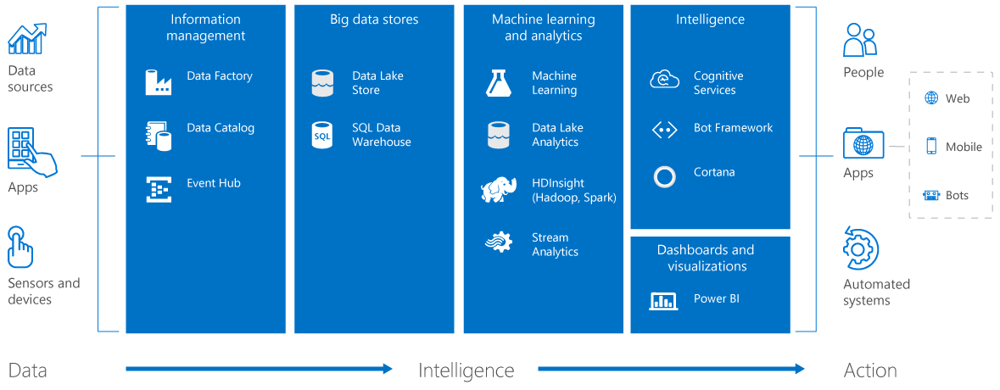

# Awesome Azure - Advanced Analytics
Awesome big data and advanced analytics resources for the Microsoft Azure Cloud

## Contributing

Your contributions are welcomed! Please send a pull request to contribute. Make sure you check out the the [Markdown Syntax](https://guides.github.com/features/mastering-markdown/)
guide and add the link you want to contribute in alphabetical order.

## Table of Contents

- [General Resources](#general-resources)
- [Training Resources](#training-resources)
- [Technical Certifications](#technical-certifications)
- [Cortana Intelligence Suite](#cortana-intelligence-suite)
- [Azure Analysis Services](#azure-analysis-services)
- [Azure Cognitive Services](#azure-cognitive-services)
- [Azure Cosmo DB](#azure-cosmo-db)
- [Azure Data Catalog](#azure-data-catalog)
- [Azure Data Factory](#azure-data-factory)
- [Azure Data Lake](#azure-data-lake)
- [Azure Event Hubs](#azure-event-hubs)
- [Azure HDInsight](#azure-hdinsight)
- [Azure IoT Hub](#azure-iot-hub)
- [Azure Machine Learning](#azure-machine-learning)
- [Azure Redis Cache](#azure-redis-cache)
- [Azure SQL Database](#azure-sql-database)
- [Azure SQL Data Warehouse](#azure-sql-data-warehouse)
- [Azure Stream Analytics](#azure-stream-analytics)
- [Azure Time Series Insights](#azure-time-series-insights)
- [Deep Learning on Azure](#deep-learning-on-azure)
- [Jupyter Notebooks](#jupyter-notebooks)
- [Microsoft Bot Framework](#microsoft-bot-framework)
- [Microsoft Data Science VMs](#microsoft-data-science-vms)
- [Microsoft Power BI](#microsoft-power-bi)
- [Microsoft R Server](#microsoft-r-server)

- - -

## General Resources

* [Free Azure Subscription](https://azure.microsoft.com/en-us/free/)
* [Interactive Azure Platform Big Picture](http://azureplatform.azurewebsites.net/en-us/)
* [Azure Periodic Table](http://www.concurrency.com/landing/azure-periodic-table)
* [Azure Marketplace](https://azuremarketplace.microsoft.com/en-us/marketplace/)
* [Awesome Azure: Tools, Guides, Tutorials](https://github.com/wangyihaier/awesome-azure)
* [Awesome Azure: IoT](https://github.com/formulahendry/awesome-azure-iot)
* [Azure Blog](https://azure.microsoft.com/en-us/blog/)
* [Azure Forums](https://azure.microsoft.com/en-us/support/forums/)
* [Azure Updates](https://azure.microsoft.com/en-us/updates/)
* [Azure Roadmap](https://azure.microsoft.com/en-us/roadmap/)
* [Azure Learning Paths](https://azure.microsoft.com/en-us/documentation/learning-paths/)
* [Azure Code Samples](https://azure.microsoft.com/en-us/documentation/samples/)
* [Azure Quickstart Templates](https://azure.microsoft.com/en-us/documentation/templates/)
* [Azure Readiness GitHub Repos](https://github.com/Azure-Readiness)
* [AzureCAT Guidance Blog](https://blogs.msdn.microsoft.com/azurecat/)
* [Data Platform Blogs](https://blogs.msdn.microsoft.com/data-platform/)
* [Analytics Partner Solution Showcase](http://analyticspartner.microsoft.com/)

## Training Resources

* [Microsoft Virtual Academy](https://mva.microsoft.com/)
* [Free eBooks from Microsoft Press](https://mva.microsoft.com/ebooks)
* [Azure Online Training Courses](https://www.microsoft.com/en-us/learning/azure-skills-training.aspx)
* [Azure Certification: Where to Start?](https://buildazure.com/2016/09/29/azure-certification-where-to-start-2016-edition/)
* [Learn Analytics @ Microsoft](http://learnanalytics.microsoft.com/)
* [edX.org Courses on Azure](https://www.edx.org/course?search_query=azure)
* [Videos: Channel 9](https://channel9.msdn.com/)
* [AWS to Azure Services Comparison](https://docs.microsoft.com/en-us/azure/architecture/aws-professional/services)

## Technical Certifications

* [Microsoft Certifications Overview](https://www.microsoft.com/en-us/learning/browse-all-certifications.aspx)
* [Azure Analytics Certifications Overview](http://learnanalytics.microsoft.com/home/certifications)
* [Microsoft Professional Program – Data Science](https://academy.microsoft.com/en-us/professional-program/data-science/)
* [70-473 Designing and Implementing Cloud Data Platform Solutions](https://www.microsoft.com/en-us/learning/exam-70-473.aspx)
* [70-475 Designing and Implementing Big Data Analytics Solutions](https://www.microsoft.com/en-us/learning/exam-70-475.aspx)
* [70-773 Analyzing Big Data with Microsoft R](https://www.microsoft.com/en-us/learning/exam-70-773.aspx)
* [70-774 Perform Cloud Data Science with Azure Machine Learning](https://www.microsoft.com/en-us/learning/exam-70-774.aspx)
* [70-775 Perform Data Engineering on Microsoft Azure HDInsight](https://www.microsoft.com/en-us/learning/exam-70-775.aspx)

## Cortana Intelligence Suite
*A fully managed big data and advanced analytics suite*

* [Overview](https://www.microsoft.com/en-us/cloud-platform/what-is-cortana-intelligence-suite)
* [Blog](https://blogs.technet.microsoft.com/machinelearning/)
* [CIS Gallery](https://gallery.cortanaintelligence.com/)
* [Solution Templates](https://gallery.cortanaintelligence.com/solutions)
* [Application Gallery](https://appsource.microsoft.com/en-us/marketplace/apps?product=cortana-intelligence)

## Azure Analysis Services
*An enterprise-grade data modeling engine in the cloud*

* [Overview](https://azure.microsoft.com/en-us/services/analysis-services/)
* [Blog](https://blogs.msdn.microsoft.com/analysisservices/)
* [Documentation](https://docs.microsoft.com/en-us/azure/analysis-services/)

## Azure Cognitive Services
*A collection of APIs to tap into vision, speech, language, knowledge, and search technologies*

* [Overview (List of APIs)](https://azure.microsoft.com/en-us/services/cognitive-services/)
* [Blog](https://azure.microsoft.com/en-us/blog/topics/cognitive-services/)
* [Documentation](https://docs.microsoft.com/en-us/azure/cognitive-services/)
* [Cognitive Services Labs](https://labs.cognitive.microsoft.com/)
* [Custom Vision Service Portal](https://www.customvision.ai/)
* [Microsoft Translator](https://translator.microsoft.com/)
* [Utilities for Microsoft Translator](https://github.com/MicrosoftTranslator)
* [Recommendation API UI](https://recommendations-portal.azurewebsites.net)
* [Intelligent Kiosk Sample](https://github.com/Microsoft/Cognitive-Samples-IntelligentKiosk)
* [Tutorial: Build Mobile App with Chat](https://github.com/Microsoft/Build-Mobile-App-with-Chat)

## Azure Cosmo DB
*A globally distributed, multi-model NoSQL database service: key-value, graph, document (JSON)*

* [Overview](https://azure.microsoft.com/en-us/services/cosmos-db/)
* [Technical Overview](https://azure.microsoft.com/en-us/blog/a-technical-overview-of-azure-cosmos-db/)
* [Documentation](https://docs.microsoft.com/en-us/azure/cosmos-db/)
* [Local Emulator](https://docs.microsoft.com/en-us/azure/documentdb/documentdb-nosql-local-emulator)
* [Database Migration Tool](https://docs.microsoft.com/en-us/azure/documentdb/documentdb-import-data)
* [DocumentDB: 10 GitHub Samples](https://azure.microsoft.com/en-us/blog/10-github-samples-with-azure-documentdb-you-shouldn-t-miss/)

## Azure Data Catalog
*A tool to register, enrich, discover, understand, and consume data sources*

* [Overview](https://azure.microsoft.com/en-us/services/data-catalog/)
* [Documentation](https://docs.microsoft.com/en-us/azure/data-catalog/)
* [Learning Path](https://azure.microsoft.com/en-us/documentation/learning-paths/data-catalog/)

## Azure Data Factory
*A globally deployed data movement, orchestration, scheduling, and monitoring service*

* [Overview](https://azure.microsoft.com/en-us/services/data-factory/)
* [Documentation](https://azure.microsoft.com/en-us/documentation/services/data-factory/)
* [Learning Path](https://azure.microsoft.com/en-us/documentation/learning-paths/data-factory/)
* [Frequently Asked Questions](https://docs.microsoft.com/en-us/azure/data-factory/data-factory-faq)

## Azure Data Lake
*A distributed storage and analytics service that scales dynamically*

* [Overview](https://azure.microsoft.com/en-us/solutions/data-lake/)
* [Blog](https://blogs.msdn.microsoft.com/azuredatalake/)
* [GitHub Repo](https://github.com/Azure/AzureDataLake)
* [Data Lake Store Documentation](https://azure.microsoft.com/en-us/documentation/services/data-lake-store/)
* [Data Lake Store Learning Path](https://azure.microsoft.com/en-us/documentation/learning-paths/data-lake-store-self-guided-training/)
* [Data Lake Analytics Documentation](https://azure.microsoft.com/en-us/documentation/services/data-lake-analytics/)
* [Data Lake Analytics Learning Path](https://azure.microsoft.com/en-us/documentation/learning-paths/data-lake-analytics-self-guided-training/)
* [Video Series](https://channel9.msdn.com/Series/AzureDataLake)
* [Introducing U-SQL](http://usql.io/)
* [U-SQL Language Reference](https://msdn.microsoft.com/en-US/library/azure/mt591959(Azure.100).aspx)
* [AdlCopy Tool](https://azure.microsoft.com/en-us/documentation/articles/data-lake-store-copy-data-azure-storage-blob/)
* [Tools for Visual Studio](https://azure.microsoft.com/en-us/documentation/articles/data-lake-analytics-data-lake-tools-get-started/)

## Azure Event Hubs
*A cloud-scale telemetry ingestion from websites, apps, and devices*

* [Overview](https://azure.microsoft.com/en-us/services/event-hubs/)
* [Documentation](https://azure.microsoft.com/en-us/documentation/articles/event-hubs-overview/)
* [Learning Path](https://azure.microsoft.com/en-us/documentation/learning-paths/event-hubs/)

## Azure HDInsight
*A managed Apache Hadoop, Spark, Storm, HBase, and R cloud service*

* [Overview](https://azure.microsoft.com/en-in/services/hdinsight/)
* [Blog](https://blogs.msdn.microsoft.com/azuredatalake/)
* [Documentation](https://azure.microsoft.com/en-us/documentation/services/hdinsight/)
* [Learning Path](https://azure.microsoft.com/en-us/documentation/learning-paths/hdinsight-self-guided-hadoop-training/)
* [Apache Hive, Interactive](https://docs.microsoft.com/en-us/azure/hdinsight/hdinsight-hadoop-use-interactive-hive)
* [Apache Pig](https://azure.microsoft.com/en-us/documentation/articles/hdinsight-use-pig/)
* [Apache Kafka](https://docs.microsoft.com/en-us/azure/hdinsight/hdinsight-apache-kafka-introduction)
* [Apache Storm](https://azure.microsoft.com/en-us/documentation/articles/hdinsight-storm-overview/)
* [Apache Spark](https://azure.microsoft.com/en-us/documentation/articles/hdinsight-apache-spark-overview/)
* [Apache HBase](https://azure.microsoft.com/en-us/documentation/articles/hdinsight-hbase-overview/)
* [Apache Solr](https://azure.microsoft.com/en-us/documentation/articles/hdinsight-hadoop-solr-install-linux/)
* [Apache Giraph](https://azure.microsoft.com/en-us/documentation/articles/hdinsight-hadoop-giraph-install-linux/)
* [Microsoft R Server](https://azure.microsoft.com/en-us/documentation/articles/hdinsight-hadoop-r-server-overview/)
* [Hue](https://azure.microsoft.com/en-us/documentation/articles/hdinsight-hadoop-hue-linux/)
* [Tools & Samples GitHub Repo](https://github.com/hdinsight)
* [Free eBook on HDInsight](https://blogs.msdn.microsoft.com/microsoft_press/2014/05/27/free-ebook-introducing-microsoft-azure-hdinsight/)
* [edX.org XSeries Program](https://www.edx.org/xseries/microsoft-azure-hdinsight-big-data-analyst)
* [Tools for Visual Studio](https://azure.microsoft.com/en-us/documentation/articles/hdinsight-hadoop-visual-studio-tools-get-started/)

## Azure IoT Hub
*A cloud service to connect, monitor, and manage billions of IoT assets*

* [Overview](https://azure.microsoft.com/en-us/services/iot-hub/)
* [Documentation](https://docs.microsoft.com/en-us/azure/iot-hub/)
* [IoT Suite](https://www.microsoft.com/en-us/internet-of-things/azure-iot-suite)
* [IoT Edge](https://azure.microsoft.com/en-us/campaigns/iot-edge/)
* [Learning Path](https://azure.microsoft.com/en-us/documentation/learning-paths/iot-hub/)
* [Developer Center](https://azure.microsoft.com/en-us/develop/iot/)
* [Gateway SDK](https://azure.microsoft.com/en-us/services/iot-hub/iot-gateway-sdk/)
* [Awesome Azure: IoT](https://github.com/formulahendry/awesome-azure-iot)

## Azure Machine Learning
*An environment to build, test, and deploy predictive analytics models*

* [Overview](https://studio.azureml.net/)
* [Blog](https://blogs.technet.microsoft.com/machinelearning/)
* [Documentation](https://azure.microsoft.com/en-us/documentation/services/machine-learning/)
* [Frequently Asked Questions](https://azure.microsoft.com/en-us/documentation/articles/machine-learning-faq/)
* [How to Choose Algorithms for AzureML](https://azure.microsoft.com/en-us/documentation/articles/machine-learning-algorithm-choice/)
* [Re-train a Machine Learning Model](https://azure.microsoft.com/en-us/documentation/articles/machine-learning-retrain-machine-learning-model/)
* [Experiments Gallery](https://gallery.cortanaintelligence.com/experiments)
* [Templates Gallery](https://gallery.cortanaintelligence.com/Collection/Machine-Learning-Templates-with-Azure-ML-Studio-1)
* [R Client](https://github.com/RevolutionAnalytics/AzureML)
* [Python Client](https://github.com/Azure/Azure-MachineLearning-ClientLibrary-Python)
* [PowerShell Commandlet Library](https://github.com/hning86/azuremlps)
* [Operationalizing ML Models on Azure](https://github.com/Azure/Machine-Learning-Operationalization)
* [Hands-On Lab](https://github.com/Azure-Readiness/hol-azure-machine-learning)
* [Video Series: Data Science for Beginners](https://azure.microsoft.com/en-us/documentation/articles/machine-learning-data-science-for-beginners-the-5-questions-data-science-answers/)
* [Video Series: Hands-On with AzureML](https://mva.microsoft.com/en-US/training-courses/handson-with-azure-machine-learning-16638?l=2oXJxvJrC_506218965)
* [Free eBook on AzureML](https://blogs.msdn.microsoft.com/microsoft_press/2015/04/15/free-ebook-microsoft-azure-essentials-azure-machine-learning/)

## Azure Redis Cache
*A secure, managed, dedicated Redis cache*

* [Overview](https://azure.microsoft.com/en-us/services/cache/)
* [Documentation](https://docs.microsoft.com/en-us/azure/redis-cache/)
* [Learning Path](https://azure.microsoft.com/en-us/documentation/learning-paths/redis-cache/)
* [Frequently Asked Questions](https://docs.microsoft.com/en-us/azure/redis-cache/cache-faq)

## Azure SQL Database
*A managed cloud database for app developers*

* [Overview](https://azure.microsoft.com/en-us/services/sql-database/)
* [Documentation](https://docs.microsoft.com/en-us/azure/sql-database/)
* [Learning Path](https://azure.microsoft.com/en-us/documentation/learning-paths/sql-database-training-learn-sql-database/)
* [Elastic DB Features](https://azure.microsoft.com/en-us/documentation/learning-paths/sql-database-elastic-scale/)

## Azure SQL Data Warehouse
*An elastic data warehouse as a service with enterprise-class features*

* [Overview](https://azure.microsoft.com/en-us/services/sql-data-warehouse/)
* [Blog](https://azure.microsoft.com/en-us/blog/tag/azure-sql-data-warehouse/)
* [Documentation](https://azure.microsoft.com/en-us/documentation/services/sql-data-warehouse/)
* [PolyBase Guide](https://azure.microsoft.com/en-us/documentation/articles/sql-data-warehouse-load-polybase-guide/)
* [sqlcmd Utility](https://msdn.microsoft.com/library/ms162773.aspx)
* [PowerShell Commandlets & REST APIs](https://azure.microsoft.com/en-us/documentation/articles/sql-data-warehouse-reference-powershell-cmdlets/)
* [edX.org Course](https://www.edx.org/course/delivering-data-warehouse-cloud-microsoft-dat220x)
* [Query from Visual Studio](https://azure.microsoft.com/en-us/documentation/articles/sql-data-warehouse-query-visual-studio/)

## Azure Stream Analytics
*A fully managed, SQL-based, real-time event processing engine*

* [Overview](https://azure.microsoft.com/en-us/services/stream-analytics/)
* [Blog](https://blogs.msdn.microsoft.com/streamanalytics/)
* [Documentation](https://azure.microsoft.com/en-us/documentation/services/stream-analytics/)
* [Learning Path](https://azure.microsoft.com/en-us/documentation/learning-paths/stream-analytics/)

## Azure Time Series Insights
*A fully managed analytics, storage, and visualization service to explore and analyze IoT events*

* [Overview](https://azure.microsoft.com/en-us/services/time-series-insights/)
* [Documentation](https://docs.microsoft.com/en-us/azure/time-series-insights/time-series-insights-overview)
* [Portal](https://insights.timeseries.azure.com/)

## Deep Learning on Azure

* [Microsoft Cognitive Toolkit (CNTK)](https://www.microsoft.com/en-us/cognitive-toolkit/)
* [Distributed Machine Learning Toolkit](http://www.dmtk.io/)
* [Microsoft R Server - MicrosoftML Package](https://msdn.microsoft.com/en-us/microsoft-r/microsoftml-introduction)
* [Azure Batch AI Training](https://batchaitraining.azure.com/)
* [Azure Batch Shipyard Recipes](https://github.com/Azure/batch-shipyard/tree/master/recipes#deep-learning)
* [Deep Learning Toolkit for Data Science VM](https://azuremarketplace.microsoft.com/en-us/marketplace/apps/microsoft-ads.dsvm-deep-learning)
* [Operationalize Spark, Tensorflow, and CNTK Models on AzureML](https://github.com/Azure/Machine-Learning-Operationalization)
* [Cognitive Toolkit and TensorFlow on Azure HDInsight](https://blogs.technet.microsoft.com/machinelearning/2017/04/12/embarrassingly-parallel-image-classification-using-cognitive-toolkit-tensorflow-on-azure-hdinsight-spark/)
* [BigDL on Azure HDInsight](https://azure.microsoft.com/en-us/blog/use-bigdl-on-hdinsight-spark-for-distributed-deep-learning/)
* [H2O.ai on Azure HDInsight](https://azure.microsoft.com/en-us/blog/introducing-h2o-ai-with-on-azure-hdinsight-to-bring-the-most-robust-ai-platform-for-enterprises/)

## Jupyter Notebooks
*A web application to create documents containing live code, visualizations and explanatory text*

* [Standalone Notebooks](https://notebooks.azure.com/)
* [AzureML Notebooks](https://gallery.cortanaintelligence.com/notebooks)

## Microsoft Bot Framework
*A framework to build and deploy high-quality bots for conversation experiences*

* [Blog](https://blog.botframework.com/)
* [Bot Framework Overview](https://dev.botframework.com/)
* [Bot Framework Documentation](https://docs.microsoft.com/en-us/bot-framework/)
* [Azure Bot Service Overview](https://azure.microsoft.com/en-us/services/bot-service/)
* [Azure Bot Service Documentation](https://docs.microsoft.com/en-us/bot-framework/azure/azure-bot-service-overview)
* [Cortana Developer Portal](https://developer.microsoft.com/en-us/Cortana)
* [Add Intelligence with Cognitive Services](https://docs.microsoft.com/en-us/bot-framework/cognitive-services-bot-intelligence-overview)
* [Language Understanding Intelligent Service](https://www.luis.ai/)
* [Bot Framework Emulator](https://docs.microsoft.com/en-us/bot-framework/debug-bots-emulator)
* [Bot Framework WebChat](https://github.com/microsoft/botframework-webchat)
* [Bot Builder SDK](https://github.com/Microsoft/BotBuilder)
* [Bot Builder Samples](https://github.com/Microsoft/BotBuilder-Samples)
* [Bot Analytics](https://docs.microsoft.com/en-us/bot-framework/portal-analytics-overview)
* [Channel Inspector](https://docs.botframework.com/en-us/channel-inspector/channels/Skype/)
* [QnA Maker](https://qnamaker.ai/)
* [Principles of Bot Design](https://docs.microsoft.com/en-us/bot-framework/bot-design-principles)
* [Great List of Resources](https://blogs.msdn.microsoft.com/smich/2016/09/30/microsoft-bot-framework-resources/)
* [Video: Getting Started with Bots](https://mva.microsoft.com/en-us/training-courses/getting-started-with-bots-16759?l=2zTAb2HyC_3504668937)

## Microsoft Data Science VMs
*Azure VM images pre-installed and configured with popular tools for analytics and machine learning*

* [Overview](https://docs.microsoft.com/en-us/azure/machine-learning/machine-learning-data-science-virtual-machine-overview)
* [Provision the Windows Data Science Virtual Machine](https://azure.microsoft.com/en-us/documentation/articles/machine-learning-data-science-provision-vm/)
* [Provision the Linux Data Science Virtual Machine](https://azure.microsoft.com/en-us/documentation/articles/machine-learning-data-science-linux-dsvm-intro/)
* [Deep Learning toolkit for the DSVM, using Azure GPUs](https://azure.microsoft.com/en-us/marketplace/partners/microsoft-ads/dsvm-deep-learningtoolkit/)
* [Ten things you can do on the Data science Virtual Machine](https://azure.microsoft.com/en-us/documentation/articles/machine-learning-data-science-vm-do-ten-things/)
* [Data science on the Linux Data Science Virtual Machine](https://azure.microsoft.com/en-us/documentation/articles/machine-learning-data-science-linux-dsvm-walkthrough/)
* [Team Data Science Process Learning Path](https://azure.microsoft.com/en-us/documentation/learning-paths/data-science-process/)

## Microsoft Power BI
*A suite of business analytics tools to analyze data, create visualizations and share insights*

* [Overview](https://powerbi.microsoft.com/en-us/)
* [Blog](https://powerbi.microsoft.com/en-us/blog/)
* [Documentation](https://powerbi.microsoft.com/en-us/documentation/powerbi-landing-page/)
* [Guided Learning](https://powerbi.microsoft.com/en-us/guided-learning/)
* [edX.org Course](https://www.edx.org/course/analyzing-visualizing-data-power-bi-microsoft-dat207x-3)
* [Custom Visuals Gallery](https://app.powerbi.com/visuals/)
* Power BI Desktop
    * [Overview](https://powerbi.microsoft.com/en-us/desktop/)
    * [Documentation](https://powerbi.microsoft.com/en-us/documentation/powerbi-desktop-get-the-desktop/)
    * [Create Visuals Using R](https://powerbi.microsoft.com/en-us/documentation/powerbi-desktop-r-visuals/)
    * [Use R in Query Editor](https://powerbi.microsoft.com/en-us/documentation/powerbi-desktop-r-in-query-editor/)
* Power BI Embedded
    * [Overview](https://azure.microsoft.com/en-us/services/power-bi-embedded/)
    * [Documentation](https://azure.microsoft.com/en-us/documentation/services/power-bi-embedded/)
* Power BI Service
    * [Overview](https://powerbi.microsoft.com/en-us/features/)
    * [Documentation](https://powerbi.microsoft.com/en-us/documentation/powerbi-service-basic-concepts/)
    * [REST API Documentation](https://msdn.microsoft.com/en-us/library/dn877544.aspx)

## Microsoft R Server
*A scalable and deployable enterprise-class R analytics platform*

* [Overview](https://www.microsoft.com/en-us/cloud-platform/r-server)
* [Documentation](https://msdn.microsoft.com/en-us/microsoft-r/index)
* [Microsoft R Blog](https://blogs.msdn.microsoft.com/rserver/)
* [Tiger Team Blog](https://blogs.msdn.microsoft.com/microsoftrservertigerteam/)
* [Revolution Analytics Blog](http://blog.revolutionanalytics.com/)
* [Diving into Data Analysis in Microsoft R](https://msdn.microsoft.com/en-us/microsoft-r/data-analysis-in-microsoft-r)
* ScaleR
    * [Introduction to ScaleR](https://msdn.microsoft.com/en-us/microsoft-r/scaler-user-guide-introduction)
    * [List of ScaleR Functions](https://msdn.microsoft.com/en-us/microsoft-r/scaler/scaler)
* [MicrosoftML Package](https://msdn.microsoft.com/en-us/microsoft-r/microsoftml-get-started)
* [R Client (free)](https://msdn.microsoft.com/en-us/microsoft-r/r-client-get-started)
* [R Server on Hadoop](https://msdn.microsoft.com/en-us/microsoft-r/scaler-hadoop-getting-started)
* [R Server on Spark](https://msdn.microsoft.com/en-us/microsoft-r/scaler-spark-getting-started)
* [R Server on HDInsight](https://azure.microsoft.com/en-us/documentation/articles/hdinsight-hadoop-r-server-overview/)
* [R Server on Teradata DB](https://msdn.microsoft.com/en-us/microsoft-r/scaler-teradata-getting-started)
* SQL Server R Services
    * [Overview](https://docs.microsoft.com/en-us/sql/advanced-analytics/r-services/sql-server-r-services)
    * [SQL Server Machine Learning Tutorials](https://docs.microsoft.com/en-us/sql/advanced-analytics/tutorials/machine-learning-services-tutorials)
    * [Machine Learning Samples & Templates](https://github.com/Microsoft/SQL-Server-R-Services-Samples)
    * [Machine Learning Model Management](https://blogs.technet.microsoft.com/dataplatforminsider/2016/10/17/sql-server-as-a-machine-learning-model-management-system/)
    * [Free eBook - Data Science with SQL Server](https://blogs.technet.microsoft.com/machinelearning/2016/10/19/data-science-with-microsoft-sql-server-2016-free-ebook/)
* [Operationalization with R Server](https://msdn.microsoft.com/en-us/microsoft-r/operationalize/about)
* [Microsoft R Application Network](https://mran.microsoft.com/)
* [Revolution Analytics GitHub Repos](https://github.com/RevolutionAnalytics)
* [Sample Code and Data for R Server and R Client](https://github.com/Microsoft/microsoft-r)
* [A Collection of Simple Demos](https://github.com/bensadeghi/R-demos/tree/master/MS-R)
* [Video Series: Introduction to Microsoft R](https://channel9.msdn.com/Series/Microsoft-R-Server-Series)
* [Microsoft R for Data Science Workshop](https://akzaidi.github.io/R-cadence/)
* [Tools for Visual Studio](https://microsoft.github.io/RTVS-docs/)
